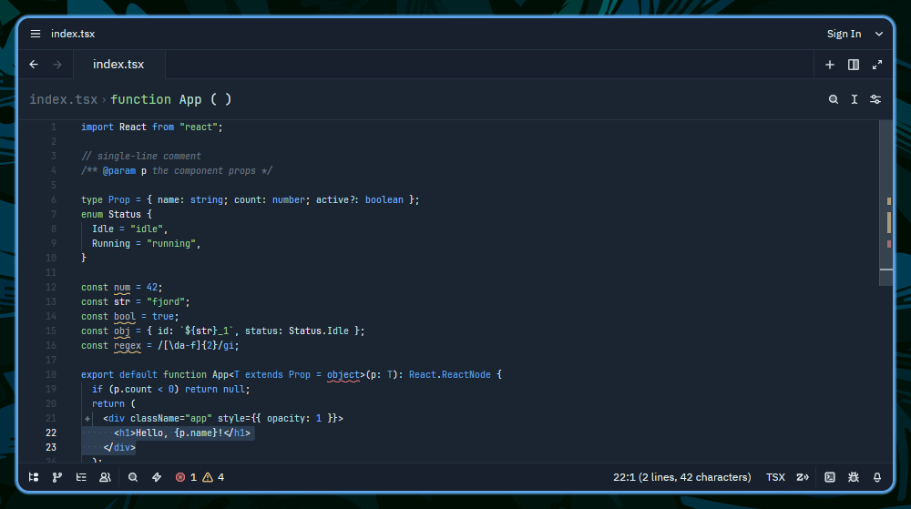

# Fjord Theme for Zed

A dusk-blue base with primary leaf-green accents, cyan selections, and crisp blue/cyan separation for the Zed editor.




## 🎨 Color Palette

### Core Colors

| Color | Name |
| ---- | ----------------- |
|  | **background** |
|  | **backgroundAlt** |
|  | **surface** |
|  | **line** |
|  | **foreground** |
|  | **muted** |
|  | **mutedDim** |

### Accent Colors

| Color | Name |
| ---- | ---------------------------- |
|  | **green** _(primary accent)_ |
|  | **blue** |
|  | **yellow** |
|  | **purple** |
|  | **red** |
|  | **cyan** |

## 📦 Installation

### From Zed Marketplace

1. Open Zed
2. Open the Extensions panel (`Cmd+Shift+X` on macOS, `Ctrl+Shift+X` on Linux/Windows)
3. Search for "Fjord"
4. Click Install

### Manual Installation


1. Clone the theme to your config directory:

```bash
mkdir -p ~/.config/zed/themes/
git clone https://github.com/fjord-themes/fjord-zed.git --depth 1 ~/.config/zed/themes/fjord-zed
```

2. Copy the theme file to your Zed themes directory:

```bash
cp ~/.config/zed/themes/fjord-zed/themes/fjord.json ~/.config/zed/themes/fjord.json
```


3. Open the theme picker (`Ctrl+K Ctrl+T` on Linux/Windows, `Cmd+K Cmd+T` on macOS) and select **Fjord**.


## 🔧 Configuration

The theme is designed to work transparently with your terminal colors while providing optimal contrast and readability in Zed.
## 🔄 Updates

This theme is automatically generated from [fjord-core](https://github.com/fjord-themes/fjord-core) and deployed on every release. For an overview of all supported platforms and the full color palette, visit the [Fjord GitHub page](https://github.com/fjord-themes).
## ☕ Support My Work

If you enjoy the Fjord theme and find it useful, consider supporting my work:

[](https://buymeacoffee.com/jshuntley)
## 📄 License

MIT License - see [LICENSE](LICENSE) file for details.
## 🤝 Contributing

For theme suggestions or issues, please open an issue on the [Zed theme repository](https://github.com/fjord-themes/fjord-zed/issues).